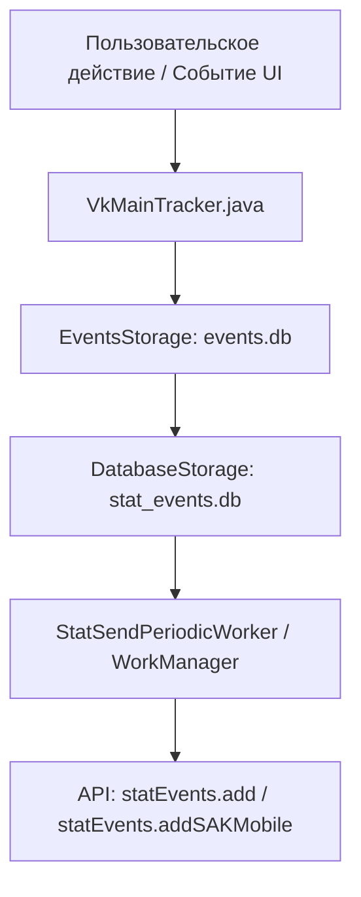

# Подробный отчет об аудите телеметрии, слежки и сбора данных в VKall

Дата аудита: 30 июля 2026 г.  
Целевой проект: [/home/alex/dev/VKall](file:///home/alex/dev/VKall)  
Пакет модификации: `tech.r4r1ty.vkall` (оригинальный клиент: `com.vkontakte.android` v8.188.1)

---

## 1. Обзор и сводные результаты

В ходе автоматизированного и статического анализа декомпилированных исходных кодов (`smali_src`, `decompiled_src`, `AndroidManifest.xml`) обнаружен комплекс систем сбора информации о пользователе, устройстве и его активности. 

Вся выявленная телеметрия делится на 5 основных категорий:
1. **Внешние трекинговые SDK** (MyTracker, AppMetrica, Firebase, OMID, MyTarget).
2. **Сбор идентификаторов устройства и Fingerprinting** (Android ID, DeviceID, сканирование установленных приложений, геолокация GPS).
3. **Внутреннее ядро VK Stat Engine** (Локальные базы данных SQLite `events.db` и `stat_events.db`, фоновый батчинг через WorkManager и отправка на эндпоинты `statEvents.*`).
4. **Механизмы защиты аналитического трафика** (AES-GCM шифрование пакетов логов, SSL Pinning, Root-check, Anti-debugging).
5. **Нативные библиотеки (.so)** (Нативный перехват функций PLT/Inline Hooking в `libshadowhook.so` и `libtrhook2.so`).

> [!NOTE]
> Внесенные изменения самой модификации `tech.r4r1ty.vkall` не содержат сторонних вредоносных кейлоггеров или скрытых эндпоинтов от автора мода. Вся активная телеметрия является оригинальным функционалом VK Group / Mail.Ru.

---

## 2. Сторонние системы трекинга и аналитики (SDK)

### 2.1 MyTracker (Mail.Ru / VK Group)
* **Пакет:** `com.my.tracker`, `com/my/tracker/obfuscated/*`
* **Компоненты в манифесте:**
  * [AndroidManifest.xml:760](file:///home/alex/dev/VKall/smali_src/AndroidManifest.xml#L760) — `<service android:name="com.my.tracker.campaign.CampaignService"/>`
  * [AndroidManifest.xml:797](file:///home/alex/dev/VKall/smali_src/AndroidManifest.xml#L797) — `<receiver android:name="com.my.tracker.campaign.CampaignReceiver">` (перехватывает `com.android.vending.INSTALL_REFERRER`).
* **Функционал:** Отслеживание диплинков, установок, сессий, оператора связи, информации о сети, непрерывный забор геолокации и сканирование пакетов других приложений.

### 2.2 AppMetrica (Yandex)
* **Пакет:** `io.appmetrica.analytics` (в `smali_classes8`)
* **Модуль шифрования:** `io.appmetrica.analytics.coreutils.internal.encryption.AESEncrypter` (`AES/CBC/PKCS5Padding`)
* **Функционал:** Логирование сессий пользователя, экранов UI, краш-репортов, отслеживание атрибуции.

### 2.3 Firebase Analytics, Performance & Crashlytics (Google)
* **Пакеты:** `com.google.firebase.analytics`, `com.google.firebase.perf`, `com.google.firebase.crashlytics`
* **Регистраторы в манифесте:** [AndroidManifest.xml:920](file:///home/alex/dev/VKall/smali_src/AndroidManifest.xml#L920) (`CrashlyticsRegistrar`, `FirebaseSessionsRegistrar`, `FirebasePerfRegistrar`).
* **Protobuf схема:** [client_analytics.proto](file:///home/alex/dev/VKall/smali_src/unknown/client_analytics.proto) (`firebase.transport.ClientMetrics`).

### 2.4 Open Measurement SDK (OMID / IAB Tech Lab)
* **Файл:** [omid_session_client_v1_6_2.js](file:///home/alex/dev/VKall/smali_src/build/apk/res/raw/omid_session_client_v1_6_2.js)
* **Функционал:** Внедряемый JavaScript-модуль отслеживания видимости и фонового взаимодействия с рекламными блоками в рантайме.

### 2.5 MyTarget Ads SDK
* **Пакеты:** `com.vk.mytarget`, `com.vk.ads.analytics`
* **Функционал:** Сбор рекламного профиля пользователя, отслеживание кликов и конверсий.

---

## 3. Сбор данных устройства и Fingerprinting

### 3.1 Сканирование установленных приложений
Приложение выполняет инспекцию пакетов сторонних программ, установленных на устройстве пользователя:
* [PackageExtenstionsKt.smali](file:///home/alex/dev/VKall/smali_src/smali/com/vk/push/core/utils/PackageExtenstionsKt.smali#L701) — прямой вызов метода `PackageManager.getInstalledPackages()`.
* [k.smali](file:///home/alex/dev/VKall/smali_src/smali/com/my/tracker/obfuscated/k.smali#L209) — метод `InstalledPackagesProvider.getInstalledPackages()` в составе MyTracker.

### 3.2 Сбор Android ID и Device ID
* **Файлы:**
  * `com.vk.push.core.DeviceIdRepository` ([fe6.smali](file:///home/alex/dev/VKall/smali_src/smali/xsna/fe6.smali#L362)) — регулярный сбор и локальное сохранение `DeviceId`.
  * `xsna/ayz0.smali` — SQLite скрипт адаптации базы: `ALTER TABLE apps ADD COLUMN android_id INTEGER;`.
  * [PackageExtenstionsKt.smali](file:///home/alex/dev/VKall/smali_src/smali/com/vk/push/core/utils/PackageExtenstionsKt.smali) — получение значения `Settings.Secure.ANDROID_ID`.

### 3.3 Мониторинг GPS-геолокации
* **Файл:** [a1.smali (LocationDataProvider)](file:///home/alex/dev/VKall/smali_src/smali/com/my/tracker/obfuscated/a1.smali)
* **Механизм:** 
  * Вызов `LocationManager.requestLocationUpdates()` для постоянного обновления координат.
  * Вызов `getLastKnownLocation()` для снятия последней известной точки.
  * Запись широты, долготы, точности GPS, скорости движения и времени фиксации.

---

## 4. Архитектура внутреннего ядра VK Stat & Event Storage

В отличие от стандартных библиотек, VK использует собственную двухуровневую систему офлайн-кэширования события в SQLite с последующей пакетной отправкой.



### 4.1 Главный диспетчер событий (`VkMainTracker`)
* **Файл:** [VkMainTracker.java](file:///home/alex/dev/VKall/decompiled_src/app/src/main/java/com/vk/metrics/eventtracking/VkMainTracker.java)
* **Назначение:** Принимает события со всех модулей VK, проверяет политики (`ONCE`, `ONCE_PER_SESSION`, `ONCE_PER_VERSION`) и делегирует их в локальное хранилище.

### 4.2 Первичная база данных сырых событий (`events.db`)
* **Файлы:** [qwk.java](file:///home/alex/dev/VKall/decompiled_src/app/src/main/java/xsna/qwk.java#L18) / [k1q.java](file:///home/alex/dev/VKall/decompiled_src/app/src/main/java/xsna/k1q.java)
* **Схема таблицы:**
  ```sql
  CREATE TABLE events (
      event_name TEXT NOT NULL,
      user_id INT NOT NULL,
      app_hash TEXT NOT NULL,
      session_id INT NOT NULL,
      date INT NOT NULL
  );
  CREATE INDEX idx_name_user_id ON events(event_name, user_id);

  CREATE TABLE sessions (
      session_id INTEGER PRIMARY KEY AUTOINCREMENT
  );
  ```

### 4.3 Вторичная база готовых батчей (`stat_events.db`)
* **Файл:** `xsna.wwk` (`DatabaseStorage`)
* **Структура:** Создает 6 таблиц для разделения по приоритету: `stat_product`, `stat_product_important`, `stat_benchmark`, `stat_benchmark_important`, `stat_product_state`, `stat_benchmark_state`.

### 4.4 Периодическая фоновая отправка (WorkManager + API)
* **Классы:** `StatSendPeriodicWorker`, `StatSendPeriodicWorkWithStatInit`, `xsna.fsk0` (`StatImpl`).
* **Логика работы:**
  1. `WorkManager` по расписанию триггерит `StatSendPeriodicWorker`.
  2. Метод `fsk0.d()` считывает батчи из `stat_events.db`.
  3. Данные сериализуются в JSON через Gson.
  4. Формируются запросы к API VK:
     * Для авторизованных пользователей: `statEvents.add` / `statEvents.addSAKMobile`
     * Для неавторизованных: `statEvents.addAnonymously` / `statEvents.addSAKMobileAnonymously`
  5. После ответа 200 OK записи удаляются из SQLite (`DELETE FROM tableName WHERE id = ...`).

---

## 5. Шифрование, Root-Check, Anti-Debugging и SSL Pinning

Для затруднения сетевого анализа и предотвращения декомпиляции/перехвата трафика применяются механизмы защиты:

1. **Шифрование логов (AES-GCM / AES-CBC):**
   * Применяется в `io.appmetrica.analytics.coreutils.internal.encryption.AESEncrypter`, Huawei `hatool`, IronSource, а также в обфусцированных модулях `xsna.b61`, `xsna.c51`, `xsna.d61` (`Cipher.getInstance("AES/GCM/NoPadding")`).
2. **Проверки на Root и эмулятор (Su Check):**
   * Поиск бинарников `su` (`/system/xbin/su`, `/system/app/Superuser.apk`) в MyTarget (`com.my.tracker.obfuscated.a0`), Bigo Ads (`sg.bigo.ads.bz.b`), OK Tracer (`DeviceInfoUtils`), `xsna.fng`, `xsna.uvy0`.
3. **Защита от отладки (Anti-Debugging):**
   * Проверки `Debug.isDebuggerConnected()` в AppMetrica (`C4767d`), MBridge CrashReport, `xsna.fng`.
4. **SSL Pinning (Защита от перехвата трафика):**
   * Использование `CertificatePinner` и кастомных прокси-классов `TrustManager` в `com.vk.push.core.network.http.ssl.TrustManager` и OkHttp для блокировки MITM-перехватчиков (Charles, HTTP Caner, Burp Suite).

---

## 6. Нативные библиотеки (.so) и JNI Hooking

В директории `smali_src/lib/arm64-v8a/` присутствуют бинарные библиотеки C/C++:

| Библиотека | Описание и функционал |
| :--- | :--- |
| **`libshadowhook.so`** | Нативный фреймворк Inline/PLT Hooking для перехвата функций C/C++ в рантайме Android. |
| **`libtrhook2.so`** | Дополнительный фреймворк хукинга и отслеживания системных профилей. |
| **`libxhook.so`** | Библиотека перехвата вызовов в PLT таблицах ELF-файлов. |
| **`libverify.so`** | Модуль проверки целостности и подлинности Mail.ru (`ru.mail.libverify`). |
| **`libcrashlytics-handler.so`** | Нативный обработчик сигналов крашей C/C++ (SIGSEGV, SIGBUS). |

---

## 7. Способы полной блокировки телеметрии в VKall

Если необходимо нейтрализовать считывание и отправку метрик в моде:

1. **Отключение служб в `AndroidManifest.xml`:**
   * Закомментировать или удалить объявление `com.my.tracker.campaign.CampaignService` и `CampaignReceiver`.
2. **Нейтрализация центрального трекера (`VkMainTracker.java` / Smali):**
   * Заменить тело метода `v(Event event)` в [VkMainTracker.java](file:///home/alex/dev/VKall/decompiled_src/app/src/main/java/com/vk/metrics/eventtracking/VkMainTracker.java#L528) на пустую инструкцию `return-void`.
3. **Блокировка сбора пакетов приложений:**
   * Заменить вызов `getInstalledPackages` в `PackageExtenstionsKt.smali` на возврат пустого списка (`Collections.emptyList()`).
4. **Блокировка отправки батчей воркером:**
   * Заменить метод `doWork()` в `StatSendPeriodicWorker.smali` на возврат `ListenableWorker.Result.success()`.
